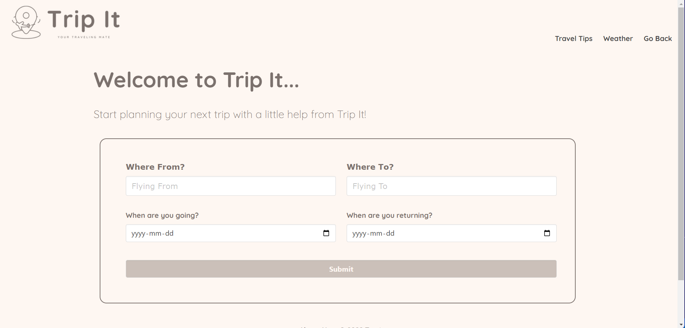
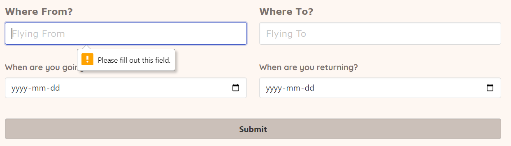
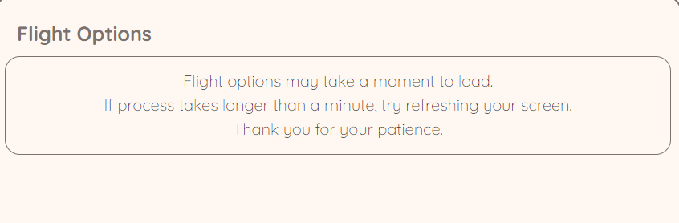
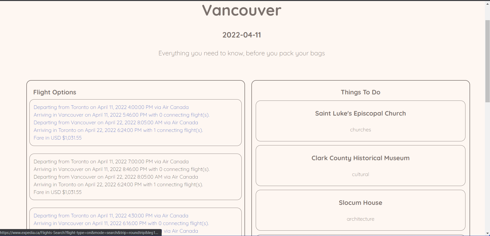

# Team Trip-It

## Table of Contents
1. [Description](#description)
2. [Motivation](#motivation)
3. [Challenges](#challenges)
4. [Screenshots](#screenshots)
5. [Technologies Applied](#technologies-applied)
6. [Future Development](#future-development)
7. [Contributors](#contributors)
8. [Links](#links)

## Description
Do you love travelling but don't know where to start when booking a trip? Trip It is your one stop site for booking your next vacation. We'll not only help you find the cheapest flights, but we'll give you ideas on activities in your desired location and tell you what the weather will be like. With Trip It, you don't have to juggle several webpages to find all your vacation needs, we have it all in one spot for you!

## Motivation
As a team, we decided that we wanted to build a travel booking website that does more that just book flights. We want our users to know that they can feel 100% confident that they're vacation is going to be worth the time and money they put into it. That's why we added the "Things to do" feature and the weather feature. 

## Challenges
First off, our biggest challenge was finding and API that we could integrate with the knowledge we had gained up until this point. Another challenge of ours was tying the weather options to the searched data and displaying it accurately on the webpage. 

## Screenshots

### Technologies Appied
* HTML
* Bulma (CSS alternative)
* JavaScript
* jQuery
* moment.js

## Future Development
* Update to allow user to send suggestion in for different functions and uses
* Implement the weather page onto the results page
* Implement further future forecast
* Add prices onto the results page with the flights
* Add an option to partner with different companies for direct purchase options
* Add more options outside of flights (e.g. entertainment in the destination)
* Add more options for user input and output 

## Contributors:
* Leandro Michelena **[leandromichelena](https://github.com/leandromichelena)**
* Eric Smith **[frodrickfronkenstein](https://github.com/frodrickfronkenstein)**
* Maggie Joseph **[maggiejoe](https://github.com/maggiejoe)** 
* Nathaniel Chan **[nchan22](https://github.com/nchan22)**

## Links
* **[Repository](https://github.com/maggiejoe/trip-it)**
* **[Live App](https://p1group5.github.io/trip-it/)**
